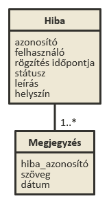

# Issue Tracker

Egy REST API amely Spring Boot segítségével készül el MVC pattern alapján, valamint egy Angular frontend, amely a felhasználói felületet biztosítja, törekszünk az MVVM pattern megtartására. Az adatokat H2 adatbázisban tárljuk a memóriában

### Feladat

Készítsünk egy webes alkalmazást, amellyel bejelentezett felhasználóként olyan hibákat jelenthetünk be, amelyek az ELTE egyes termeiben találhatóak (pl. elromlott projektor), a bejelentett hibáinkat megtekinthetjük, ezekhez megjegyszést írhatunk.
Adminként mindenki hibáját megtekinthetjük, változtathatjuk a hibák státuszát, és válaszolhatunk a felhasználók üzeneteire.
Látogatóként csak statisztikát látunk, és regisztrálhatunk.  

### További részek
    
[1. óra - Spring Boot, MVC, HTTP, H2](./README.md)

## Model kiegészítése

Bemelegítésként készítsük el az entitásokat, amelyeket az egész alkalmazásban használni fogunk.
Szükségünk lesz issues, issue-messages táblákra.

 
 
 Táblákat a @JoinColumn és valamilyen kapcsolat megadásával kapcsolahtunk össze. A kapcsolatok típusa lehet [@OneToMany @ManyToOne, @OneToOne, @ManyToMany](https://en.wikibooks.org/wiki/Java_Persistence/Relationships). Ezek valamilyen paramétert várnak, amellyel a cél táblát adjuk meg pl. targetEntity stb.
 
 A DAL rétegben lévő repositorykat is készítsük el. Legyenek CrudRepository-k így kényelmesen kezelhetjük az entitásainkat.

### Adatmodell

```
[issue| timestamp, status, description, location]
[message| text, timestamp]
[user| username, password, email, role]

[user] +-> 1..* [issue]
[issue] +-> 1..* [message]
```    

## Authorizáció, autentikáció

Azt is szeretnénk megoldani, hogy az oldal egyes részeit csak felhasználók, vagy adminok érjenek el. Ehhez be kell vezetnünk valamilyen authorizációs lépést.
Általában ilyen feladatokhoz érdemes kész megoldást használni (biztonságosabb, hatékonyabb).
RESTful szervereknél az authetikáció is állapotmentes. Általában egy tokent küldünk a bejelentkezett felhasználónak, aki ezt a tokent minden egyes kéréssel elküldi a szervernek (Authorization token a HTTP kérés header-jében), a szerver egyes végpontjainál ezt kiolvassuk és eldöntjük jogosult e az erőforrás eléréséhez.
A JWT (Json Web Token) pont egy ilyen megoldás, bár még nem szabványos. Nagyon jó megoldás lenne a [Spring Security](https://projects.spring.io/spring-security/) modult használni, ám ennek a JWT initegrációja még központilag nem történt meg, így kézzel kellene midnent configolnunk. Egy nagyobb projekt esetén érdemes venni a fáradtságot, de ez a feladat egyszerűbb nem teljesen REST megoldással is megfelelően fog működni.

- A feladat első részeként készítünk egy saját @Role annotációt, amelynek a segítségével az egyes metódusokat jelölhetjük meg, amelyeket védeni szeretnénk.
- Ezután átalakítjuk a UserService osztályunkat, hogy tárolja és ki tudja szolgálni a bejelentkezett felhasználót a HTTP session alatt.
- Majd készítünk egy Interceptort, amely lefut minden route előtt, és ellenőrzi, hogy az adott route védve, van-e és ha igen, akkor a bejelentkezett felhasználónak van-e joga megtekinteni azt 

```java
package hu.elte.alkfejl.issuetracker.service.annotations;

import hu.elte.alkfejl.issuetracker.app.model.User;

import java.lang.annotation.ElementType;
import java.lang.annotation.Retention;
import java.lang.annotation.RetentionPolicy;
import java.lang.annotation.Target;

@Retention(RetentionPolicy.RUNTIME)
@Target(ElementType.METHOD)
public @interface Role {
    User.Role[] value() default {User.Role.GUEST};
}
```   
Ezt az annotációt a service/annotations package-ben definiáltam

A @Retention annotációval azt írjuk le, hogy milyen formában legyen elérhető az annotáció. A RUNTIME jelzi, hogy futás időben reflectiönnel is elérhetőnek szeretnénk definiálni.
A @Target annotációval pedig azt jelöljük, hogy milyen kifejezésre használjuk majd. Mi metódusokra fogjuk ezt rátenni, ezért ezt álítjuk be itt
 
Az annotációknagyon hasonlítanak az interface-ekre: publikus metódusokat tudunk megadni rajtuk, default implementációval. A value() egy speciális metódus az annotációknál, hisz erre az attribútumra nem kell hivatkoznunk a megadákor, míg más nevű attribútumra igen

```java
@Service
@SessionScope
@Data
public class UserService {
    @Autowired
    private UserRepoitory userRepoitory;

    private User user;

    public User login(User user) throws UserNotValidException {
        if (isValid(user)) {
            return this.user = userRepoitory.findByUsername(user.getUsername()).get();
        }
        throw new UserNotValidException();
    }

    public User register(User user) {
        user.setRole(USER);
        this.user = userRepoitory.save(user);
        return user;
    }

    public boolean isValid(User user) {
        return userRepoitory.findByUsernameAndPassword(user.getUsername(), user.getPassword()).isPresent();
    }

    public boolean isLoggedIn() {
        return user != null;
    }
}
```

A UserService-ben létrehoztunk egy User fieldet, és rátettük azosztályra a @SessionScope annotációt, amellyel jeleztük a Spring-nek, hogy egy HTTP session során csak egy ilyen osztályt kell példányosítania, és ezt kell midnenhol használnia. Így amíg a felhasználó az oldalon marad, addig a bejelentkezése is aktív lesz.
a register és login annyivan változott, hogy most siker esetén mentjük is a felhasználót.


Egy feladat maradt hátra, az interceptor elkészítése:

```java
package hu.elte.alkfejl.issuetracker.config;

import hu.elte.alkfejl.issuetracker.app.model.User;
import hu.elte.alkfejl.issuetracker.service.UserService;
import hu.elte.alkfejl.issuetracker.service.annotations.Role;
import org.springframework.beans.factory.annotation.Autowired;
import org.springframework.stereotype.Component;
import org.springframework.web.method.HandlerMethod;
import org.springframework.web.servlet.handler.HandlerInterceptorAdapter;

import javax.servlet.http.HttpServletRequest;
import javax.servlet.http.HttpServletResponse;
import java.util.Arrays;
import java.util.Collections;
import java.util.List;

@Component
public class AuthInterceptor extends HandlerInterceptorAdapter {

    @Autowired
    private UserService userService;

    @Override
    public boolean preHandle(HttpServletRequest request, HttpServletResponse response, Object handler) throws Exception {
        List<User.Role> routeRoles = getRoles((HandlerMethod) handler);
        User user = userService.getUser();

        // when there are no restrictions, we let the user through
        if (routeRoles.isEmpty() || routeRoles.contains(User.Role.GUEST)) {
            return true;
        }
        // check role
        if (userService.isLoggedIn() && routeRoles.contains(user.getRole())) {
            return true;
        }
        response.setStatus(401);
        return false;
    }

    private List<User.Role> getRoles(HandlerMethod handler) {
        Role role = handler.getMethodAnnotation(Role.class);
        return role == null ? Collections.emptyList() : Arrays.asList(role.value());
    }
}

```
Az issuetracker.config packeg-ben létrehozunk egy AuthInterceptor-r amely a HandlerINterceptor leszármazottja és @Component. Így a Spring beankként kezeli, és a definiált preHandel metódust lefuttatja minden route-előtt.
Paraméterként fogaja a request, response és a handler-t. A handler maga a metódus amelyet a kontrollerben definiáltunk. Ha HandlerMethod típusúra castoljuk elkérhetjük a metódus annotációjit, és ellenőrizhetjük, hogy a felhasználónak megvan-e a kért jogosultsága.

A Response paramétert használhatjuk a válasz státuszának beállítására.

Ha token alapú kommunikációnk lenne (nem pedig session, mint itt), akkor itt elkérhetnénk a request headerjéből a tokent, és dolgozhatnánk azzal is. 


## REST API

Egy rendszert akkor nevezünk RESTful-nak, ha a REST minden [megszorítását](https://hu.wikipedia.org/wiki/REST#Megszor.C3.ADt.C3.A1sok) teljesítik:
- Kliens - szerver: elkülönülnek
- Állapotmentes - ugyanarra a kérésre mindig ugyanaz a válasz, a szerveren nincs állapot tárolva, nincsenek scope-ok (ezt a mi alkalmazásunk sérti)
- (Gyorsítótárazhatóság
- Réteges felépítés
- Igényelt kód
- Egységes interface)


Mivel az MVC modell alapján jól szétválasztottuk a feladatokat szerepek mentén, így könnyen ki tudjuk egészíteni az alkalmazásunkat egy REST API-val. 
Így az eddig elkészült oldalunk is használható marad, és más alkalmazásoknak is hozzáférést biztosíthatunk a szolgáltatásainkhoz.

Ahhoz, hogy REST végpontokat definiáljunk @RestController annotációjú osztályokat kell létrehoznunk, ezek lehetővé teszik, hogy a HTTP requestekben lévő JSON-t feldolgozzuk, és így küldi a response-okat is, nem próbál meg HTML-t renderelni.

Készítsük el az Issuek controllerét, ehhez az IssueService- osztályt is:

```java
package hu.elte.alkfejl.issuetracker.api;

import hu.elte.alkfejl.issuetracker.app.model.Issue;
import hu.elte.alkfejl.issuetracker.service.IssueService;
import hu.elte.alkfejl.issuetracker.service.UserService;
import hu.elte.alkfejl.issuetracker.service.annotations.Role;
import org.springframework.beans.factory.annotation.Autowired;
import org.springframework.http.ResponseEntity;
import org.springframework.web.bind.annotation.*;

import static hu.elte.alkfejl.issuetracker.app.model.User.Role.ADMIN;
import static hu.elte.alkfejl.issuetracker.app.model.User.Role.USER;

/**
 * @author Godzsák Dávid <godzsakdavid@gmail.com>
 */
@RestController
@RequestMapping("/api/issues")
public class IssueApiController {

    @Autowired
    private IssueService issueService;

    @Autowired
    private UserService userService;

    @Role({ADMIN, USER})
    @GetMapping
    private ResponseEntity<Iterable<Issue>> list() {
        Iterable<Issue> issues = issueService.listByRole(userService.getUser());
        return ResponseEntity.ok(issues);
    }

    @Role({ADMIN, USER})
    @PostMapping
    private ResponseEntity<Issue> create(@RequestBody Issue issue) {
        Issue saved = issueService.create(issue);
        return ResponseEntity.ok(saved);
    }

    @Role({ADMIN, USER})
    @GetMapping("/{id}")
    private ResponseEntity<Issue> read(@RequestParam int id) {
        Issue read = issueService.read(id);
        return ResponseEntity.ok(read);
    }

    @Role(ADMIN)
    @PutMapping("/{id}")
    private ResponseEntity<Issue> update(@RequestParam int id, @RequestBody Issue issue) {
        Issue updated = issueService.update(id, issue);
        return ResponseEntity.ok(updated);
    }

    @Role(ADMIN)
    @DeleteMapping("/{id}")
    private ResponseEntity delete(@RequestParam int id) {
        issueService.delete(id);
        return ResponseEntity.ok().build();
    }
}
```

Több érdekes dolgot láthatunk itt: 

- Az annotációnk felhasználási módját @Role(USER)
- CRUD: create read update delete metósusokat, igazi RESTful server módjára
- a @RequestBody-val a post és put metódusok body-jét érhetjük el, ha azok json-ban vannak
- a @RequestParam az url-ből érkező paramétereket oldja fel
- a ListByRole más más értéket ad vissza, ha adminként, vagy userként hívju meg, de ezt a logikát a service-ben definiáljuk, így újrafelhasználható kódot kapunk


### user

- `GET /user`
- `POST /user/register`
- `POST /user/login`

### issue

- `GET /issues`
- `GET /issues/:id`
- `POST /issues`
- `PATCH /issues/:id` /`PUT /issues/:id`
- `DELETE /issues/:id`

### message

- `GET /issues/:id/messages`
- `GET /issues/:id/messages/:mess_id`
- `POST /issues/:id/messages`
- `DELETE /issues/:id/messages`
- `DELETE /issues/:id/messages/:mess_id`


## Követelmények összegyűjtése


### Funkcionális követelmények

- Felhasználóként szeretnék bejelenteni egy gépterembeli hibát, hogy minél előbb javíthassák. --> Hiba bejelentése
- Felhasználóként szeretnék visszajelzést kapni, hogy a bejelentett hiba milyen státuszban van. --> Hibák listázása
- Felhasználóként szeretnék kérdést vagy megjegyzést fűzni egy hibához azután is, hogy felvettem. --> Hiba history, chat, forum.
- Operátorként szeretném látni a hibalistát.
- Operátorként szeretnék egy hibát megtekinteni és státuszát váltani. Státuszváltáskor kötelező üzenetet megadni.
- A felhasználók és operátorok bejelentkezés után használhatják a funkciókat. Ezeket egy előre megadott listából, vagy LDAP authentikációval kell elvégezni.
- A főoldalon az alkalmazás ismertetése, esetleg statisztikák jelenik meg.

### Nem funkcionális követelmények

- Felhasználóbarát, ergonomikus elrendezés és kinézet.
- Gyors működés.
- Biztonságos működés: jelszavak tárolása, funkciókhoz való hozzáférés.

## Szerepkörök

- vendég: a főoldal tartalmához fér hozzá, rögzíteni nem tud.
- bejelentő: a vendég szerepkörén túl hibát tud bejelenteni, és saját bejelentett hibáit megtekinteni.
- operátor: a bejelentő szerepkörén túl az összes hibát meg tudja tekinteni, és annak státuszát állítani tudja.

## Végpontok

Kérdések:

- egyes vagy többes szám (`user` /`users`)?
- ha szerepkörönként más kapunk vissza, akkor azt végpontszinten kezeljük, vagy az adott végponton belül (`/operators/issue` /`issue`)?

